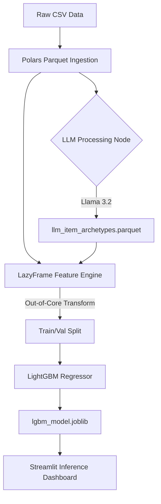

# 🔮 Retail Demand Forecaster: LLM-Enhanced Time-Series Pipeline


An end-to-end, highly optimized Machine Learning pipeline designed to forecast zero-inflated, intermittent retail demand (based on the M5 Walmart Dataset). 

This project explores the intersection of **gradient boosting for time-series forecasting** and **Large Language Models (LLMs) for semantic feature engineering**, specifically addressing the "Cold Start" problem for new inventory.

## 🎯 Business Problem & Solution
Retail demand is rarely a smooth bell curve; it is highly intermittent and zero-inflated. Standard regression models fail by predicting fractional daily units (e.g., 0.4 units/day) rather than capturing the actual behavior: 0 units for a week, followed by a sudden spike of 5 units.

**The Solution:**
1. **Tweedie Objective Function:** Utilized LightGBM with a Tweedie distribution to mathematically model zero-inflated count data, successfully lowering the baseline validation MAE to **0.9637** across 44 million rows.
2. **Polars LazyGraph Engine:** Engineered a memory-safe, out-of-core feature pipeline that processes 114MB+ of unpivoted raw data on local M1 silicon in seconds.
3. **LLM Semantic Archetypes:** Deployed a local Llama 3.2 model to categorize 3,000+ items into behavioral archetypes (e.g., *Highly Volatile*, *High-Volume Staple*) to establish baseline variance rules for items lacking historical data.

---

## 🏗️ Architecture & Data Flow

The pipeline is entirely decoupled, ensuring scalable feature generation and training.



### 1. Data Ingestion & Compression
Wide-format sales data (1,913-day columns) is unpivoted into long-format time-series data using **Polars**, reducing memory overhead and enabling temporal feature generation (lags, rolling means). Data is cast to minimal viable datatypes (`Categorical`, `Int32`) before being saved as strictly-typed Parquet files.

### 2. The LLM Feature Engine (`build_llm_archetypes.py`)
Traditional tree models group items by explicit hierarchies (`cat_id`, `dept_id`). We injected semantic context. A local Llama 3.2 instance analyzes item metadata and generates discrete categorical archetypes. This compresses 30,490 unique item-store combinations into ~3,000 distinct behavioral patterns.

---

## 🧠 Model Parameters & Math

### The LightGBM Tweedie Engine
The core algorithm is a LightGBM Regressor customized for the retail domain.

* **Objective**: `tweedie` 
* **Variance Power**: `1.1` (Tuned specifically for the M5 dataset's heavy right-tail distribution).
* **Hyperparameters**: `n_estimators=1500`, `learning_rate=0.05`, `num_leaves=63`, `min_child_samples=50`.
* **Callbacks**: Early stopping at 50 rounds to prevent overfitting on the validation holdout.

### Feature Engineering (`M5FeatureEngineer`)
Features are built on-the-fly using `pl.LazyFrame` to prevent RAM saturation.
* **Smoothed Target Encoding:** Calculates the global mean and item-specific mean, applying a smoothing factor ($m=10$) to prevent data leakage and overfitting on low-volume items.
  
$$TE=\frac{n\times\bar{x}_{item}+m\times\bar{x}_{global}}{n+m}$$

* **Cyclical Temporal Features:** Day-of-week and Month variables are transformed using Sine and Cosine waves to allow the tree to understand continuous cyclical patterns (e.g., December 31st is temporally close to January 1st).
* **Time-Series Lags:** Safety-buffered 28-day lags (`lag_28`, `lag_35`) and rolling means (`rmean_7`, `rmean_28`) to support direct, multi-step forecasting without recursive error accumulation.

---

## 🔬 Ablation Study: The "Cold Start" Strategy

During model validation, an ablation study was performed to test the efficacy of the LLM-generated features against traditional target encoding.

**Findings:**
When exact historical target encodings (`item_target_enc`) and lag features are present, gradient boosted trees assign minimal split importance to high-level LLM semantic groups. The precise mathematical history absorbs the variance.

**Business Value Pivot (The Cold Start):**
The LLM feature serves a specialized production purpose: **New Inventory**. When a new product is introduced, it lacks `lag_7` or `target_enc`. By mapping the new product to an LLM Archetype based purely on its metadata, the model has an immediate semantic baseline to begin forecasting demand on Day 1.

---

## 🚀 How to Run (Reproducibility)

This project uses `uv`, the lightning-fast Rust-based Python package manager.

**1. Clone and Install:**
```bash
git clone [https://github.com/yourusername/llm-demand-forecaster.git](https://github.com/yourusername/llm-demand-forecaster.git)
cd llm-demand-forecaster
uv sync
```

**2. Train the Model:**
```bash
uv run python src/model/train_lgb.py
```

**3. Launch the Interactive Dashboard:**
```bash
uv run streamlit run app.py
```

---
*Developed by Aung Phyo Linn (Lucas) | Machine Learning Engineer*